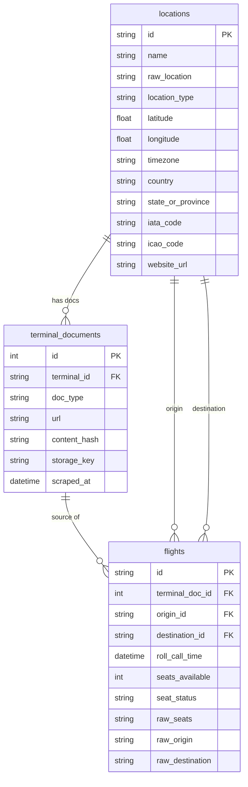
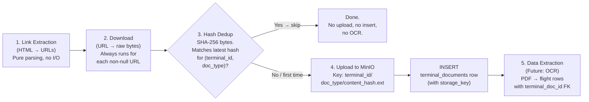

# Extraction Scraper: Multi-Document Support & Tests

Evolve the extraction pipeline to return **3 categorized document types**. Introduce an append-only `terminal_documents` table with content-hash dedup. Add data-driven integration tests.

---

## Data Model Design

### Proposed Model



### Key Design Decisions

| Concern | Decision | Rationale |
|---|---|---|
| **Storage** | Append-only | Every row = genuinely new or changed document |
| **Row granularity** | One doc per row + `doc_type` enum | No nulls. Independent update intervals per type |
| **Flight provenance** | `terminal_doc_id` FK | Exact document preserved. `source_url` and `scraped_at` removed from flights (derivable) |
| **Dedup** | Content hash (single-tier) | Always download, hash, compare. Handles both URL-versioned and static-URL sites |
| **File storage** | MinIO (S3-compatible object storage) | Cloud-agnostic. Runs locally via Docker, swap endpoint for any S3-compatible cloud in production. No binary blobs in Postgres |
| **Extensibility** | New doc type = new enum value | No schema migration |

---

## Pipeline Flow

Per terminal, per scrape cycle. Each non-null URL from the extraction result is processed independently through stages 2–5.



---

## Proposed Changes

### 1. New Enum — `DocumentType`

#### [NEW] [document.py](file:///home/alex/SpaceATracker/backend/core/core/enums/document.py)

```python
class DocumentType(StrEnum):
    SCHEDULE_72HR = "schedule_72hr"
    SCHEDULE_30DAY = "schedule_30day"
    ROLLCALL = "rollcall"
```

---

### 2. New DB Model — `TerminalDocument`

#### [NEW] [terminal_document.py](file:///home/alex/SpaceATracker/backend/core/core/models/terminal_document.py)

```python
class TerminalDocument(Base):
    __tablename__ = "terminal_documents"

    id: Mapped[int] = mapped_column(primary_key=True, autoincrement=True)
    terminal_id: Mapped[str] = mapped_column(
        String(50), ForeignKey("locations.id"), nullable=False
    )
    doc_type: Mapped[DocumentType] = mapped_column(String(50), nullable=False)
    url: Mapped[str] = mapped_column(String(2048), nullable=False)
    content_hash: Mapped[str] = mapped_column(String(64), nullable=False)
    storage_key: Mapped[str] = mapped_column(String(512), nullable=False)
    scraped_at: Mapped[datetime] = mapped_column(DateTime(timezone=True))
```

- `content_hash`: Non-nullable. Every row inserted only after download + hash.
- `storage_key`: S3/MinIO object key (e.g., `terminals/diego-garcia/schedule_72hr/a1b2c3d4.pdf`). Used to retrieve the file.

#### [MODIFY] [Flight model](file:///home/alex/SpaceATracker/backend/core/core/models/flight.py)

- Add `terminal_doc_id` FK to `terminal_documents`
- Remove `source_url` (derivable via FK)
- Remove `scraped_at` (derivable via FK)

#### [MODIFY] [models/\_\_init\_\_.py](file:///home/alex/SpaceATracker/backend/core/core/models/__init__.py)

Export `TerminalDocument` and `DocumentType`.

---

### 3. New Pydantic Schemas

#### [NEW] [terminal_document.py](file:///home/alex/SpaceATracker/backend/core/core/schemas/terminal_document.py)

```python
class TerminalDocumentCreate(BaseModel):
    terminal_id: str
    doc_type: DocumentType
    url: AnyUrl
    content_hash: str
    storage_key: str
    scraped_at: datetime

class TerminalDocumentRead(TerminalDocumentCreate):
    id: int
    model_config = ConfigDict(from_attributes=True)
```

#### [NEW] [extraction.py](file:///home/alex/SpaceATracker/backend/core/core/schemas/extraction.py)

Chain output (service splits into individual rows):

```python
class ExtractionResult(BaseModel):
    schedule_72hr_url: AnyUrl | None = None
    schedule_30day_url: AnyUrl | None = None
    rollcall_url: AnyUrl | None = None
```

#### [MODIFY] [schemas/\_\_init\_\_.py](file:///home/alex/SpaceATracker/backend/core/core/schemas/__init__.py)

Export new schemas.

---

### 4. Updated Extractor Protocol

#### [MODIFY] [base.py](file:///home/alex/SpaceATracker/backend/scraper/scraper/extraction/strategies/base.py)

```diff
- class PDFExtractor(Protocol):
-     async def extract_pdf_url(self, html, terminal) -> str | None:
+ class DocumentExtractor(Protocol):
+     async def extract_docs(self, html, terminal) -> ExtractionResult:
```

---

### 5. Modular Extractors

#### [DELETE] [standard.py](file:///home/alex/SpaceATracker/backend/scraper/scraper/extraction/strategies/standard.py)
#### [DELETE] [facebook.py](file:///home/alex/SpaceATracker/backend/scraper/scraper/extraction/strategies/facebook.py)

#### [NEW] [amc_text_link.py](file:///home/alex/SpaceATracker/backend/scraper/scraper/extraction/strategies/amc_text_link.py)

Finds document links in `<a>` tags by matching **anchor text** keywords paired with document extensions (`.pdf`, `.pptx`, etc.).

#### [NEW] [amc_image_link.py](file:///home/alex/SpaceATracker/backend/scraper/scraper/extraction/strategies/amc_image_link.py)

Finds document links in `<a>` tags wrapping `` tags. Classifies by `alt`/`title` attributes.

---

### 6. Updated Extraction Chain

#### [MODIFY] [chain.py](file:///home/alex/SpaceATracker/backend/scraper/scraper/extraction/chain.py)

Returns `ExtractionResult`. Merges across strategies (first non-`None` per field wins). Logs which strategy produced each field.

---

### 7. Updated Extraction Service

#### [MODIFY] [service.py](file:///home/alex/SpaceATracker/backend/scraper/scraper/extraction/service.py)

Orchestrates the pipeline:
1. Run chain → `ExtractionResult`
2. For each non-null URL: download → SHA-256 → compare latest hash for `(terminal_id, doc_type)`
3. Hash match → skip entirely.
4. Hash new → upload bytes to MinIO → insert `TerminalDocumentCreate` row (with `storage_key`) → hand off to OCR (future).

MinIO client is injected via constructor (same pattern as DB session). Locally runs via Docker container, production swaps the endpoint URL.

---

### 8. Integration Tests

Tests the **link extraction stage only** (pure, no DB, no downloads).

#### Test Asset Directory

```
backend/scraper/tests/extraction/assets/
├── terminal_docs_blank.csv          ← blank template (header row only)
├── 05032026/                        ← snapshot dated 05/03/2026
│   ├── terminal_docs_05032026.csv   ← ground-truth CSV
│   ├── al-udeid-terminal_05032026.html
│   ├── altus-afb-ok_05032026.html
│   └── …91 HTML files
└── {DDMMYYYY}/                      ← future snapshots follow same layout
    ├── terminal_docs_{DDMMYYYY}.csv
    └── *.html
```

- Each **subdirectory** is named by the date the data was fetched (`DDMMYYYY`).
- Each subdirectory contains the **raw HTML** of every terminal webpage that was downloadable on that date, plus a ground-truth **CSV**.
- The blank template CSV in the parent directory ([terminal_docs_blank.csv](file:///home/alex/SpaceATracker/backend/scraper/tests/extraction/assets/terminal_docs_blank.csv)) defines the column format all CSVs must follow.

#### CSV Format

Semicolon-delimited, 5 fields:

| Column | Description |
|---|---|
| `File` | Filename of the corresponding HTML file in the **same directory** as the CSV |
| `Source_URL` | URL of the terminal webpage the HTML was fetched from |
| `72_Hr_Schedule` | Manually verified link to the 72-hour schedule document (empty if none) |
| `30_Day_Schedule` | Manually verified link to the 30-day schedule document (empty if none) |
| `Rollcall` | Manually verified link to the rollcall document (empty if none) |

> [!NOTE]
> CSVs are maintained manually by the user. Empty cells mean no document link exists on that page.

#### Auto-Discovery of Asset Subdirectories

Tests **must** automatically discover all date-named subdirectories under `assets/` so that adding a new snapshot requires **zero test code changes** — just drop in the new `{DDMMYYYY}/` folder with its HTML files and CSV.

```python
ASSETS_DIR = Path(__file__).parent / "assets"

def _discover_snapshots() -> list[tuple[Path, Path]]:
    """Return (csv_path, snapshot_dir) for every date subdirectory."""
    snapshots = []
    for child in sorted(ASSETS_DIR.iterdir()):
        if not child.is_dir():
            continue
        csvs = list(child.glob("terminal_docs_*.csv"))
        if csvs:
            snapshots.append((csvs[0], child))
    return snapshots
```

Each test is then parametrized over all discovered snapshots **and** all rows within each CSV.

#### [NEW] [test_extraction_chain.py](file:///home/alex/SpaceATracker/backend/scraper/tests/extraction/test_extraction_chain.py)

| Test | Parametrized over | Assertion |
|---|---|---|
| `test_no_docs_returns_empty` | All snapshots × rows where all 3 doc columns are empty | All 3 result fields are `None` |
| `test_72hr_schedule` | All snapshots × rows with non-empty `72_Hr_Schedule` | Normalized URL matches |
| `test_30day_schedule` | All snapshots × rows with non-empty `30_Day_Schedule` | Normalized URL matches |
| `test_rollcall` | All snapshots × rows with non-empty `Rollcall` | Normalized URL matches |
| `test_strategy_coverage` | All registered strategies × all snapshots | Each strategy contributed ≥1 extraction |

URL normalization: URL-decode both sides, lowercase, then compare.

---

## Verification Plan

### Automated Tests
```bash
cd /home/alex/SpaceATracker/backend/scraper
uv run pytest tests/extraction/ -v
```

### Manual Verification
- Spot-check: Diego Garcia (cross-domain URLs), Travis AFB (image-wrapped), Altus AFB (`.pptx`), Minnesota ANG (image-only).
